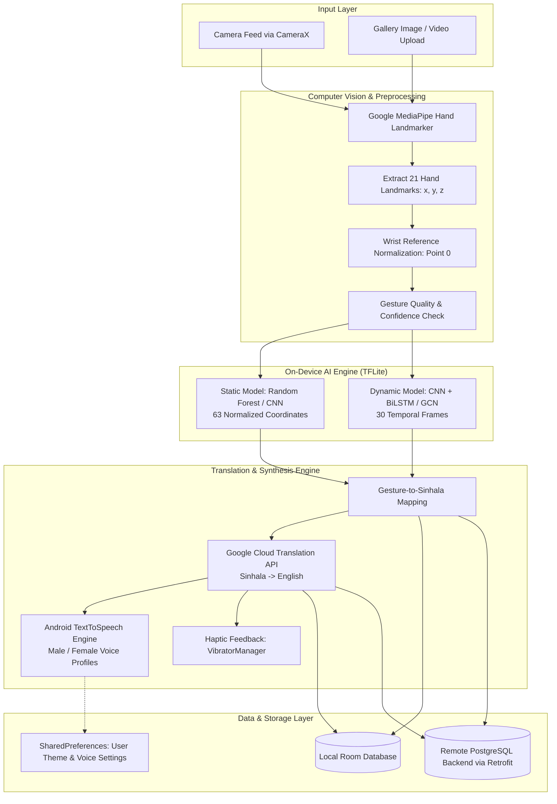

# 🖐️ MindSpark – HandTalk App
### Real-Time Sinhala Sign Language (SSL) Translation into Sinhala–English Text and Speech using Artificial Intelligence

[-3DDC84?logo=android&logoColor=white)](https://developer.android.com/)
[](https://kotlinlang.org/)
[](https://developer.android.com/jetpack/compose)
[](https://www.tensorflow.org/lite)
[](https://developers.google.com/mediapipe)
[](https://gradle.org/)
[](#-academic-project-information)

---

## 📖 Table of Contents

- [📌 Project Overview](#-project-overview)
- [✨ Key Features](#-key-features)
- [🏗️ System Architecture & Workflow](#️-system-architecture--workflow)
- [🛠️ Technology Stack](#️-technology-stack)
- [🧠 Machine Learning Models](#-machine-learning-models)
  - [1. Static Gesture Recognition](#1-static-gesture-recognition)
  - [2. Dynamic Gesture Recognition](#2-dynamic-gesture-recognition)
- [📁 Project Directory & File Structure](#-project-directory--file-structure)
  - [Root Configuration](#root-configuration)
  - [App Source Tree (`/app`)](#app-source-tree-app)
  - [Model Repositories (`/Static_model` & `/Dynamic_Model`)](#model-repositories-static_model--dynamic_model)
- [🚀 Installation & Setup Guide](#-installation--setup-guide)
  - [Prerequisites](#prerequisites)
  - [Step-by-Step Installation](#step-by-step-installation)
  - [API & Backend Configuration](#api--backend-configuration)
- [🔐 Android Permissions & Security](#-android-permissions--security)
- [👥 Developers & Team Information](#-developers--team-information)
- [📄 Academic Project Information](#-academic-project-information)
- [📃 License](#-license)

---

## 📌 Project Overview

**MindSpark – HandTalk App** is an AI-powered assistive mobile application developed to break the communication barrier between hearing- and speech-impaired individuals and the general public in Sri Lanka. 

Sign language users communicate using complex manual gestures (hand shapes, orientations, and movements) and non-manual signals. In Sri Lanka, **Sinhala Sign Language (SSL)** is the primary visual language for the Deaf community, yet few non-deaf individuals understand it.

**HandTalk App** bridges this gap by providing an end-to-end mobile translation platform:
1. Captures live hand gestures via the smartphone camera using **Android CameraX**.
2. Tracks 21 hand landmarks in real time via **Google MediaPipe Vision Tasks**.
3. Executes edge-based **TensorFlow Lite (TFLite)** deep learning models to classify both **static signs** and **dynamic gesture sequences**.
4. Maps recognized gestures into **Sinhala text**, converts them into **English text** via the **Google Cloud Translation API**, and articulates both languages aloud using **Android TextToSpeech (TTS)** with customizable voice profiles (Male/Female).
5. Provides rich supplementary modules, including **Gallery Media Recognition (Images/Videos)**, a **Sign Language Learning Hub**, and **Encrypted Translation History**.

---

## ✨ Key Features

| Feature | Description |
| :--- | :--- |
| 🎥 **Real-Time Live Translation** | Real-time camera gesture tracking with on-screen bounding boxes, landmark tracking, and instantaneous Sinhala text output. |
| 🌐 **Bilingual Translation** | Seamless translation from recognized Sinhala words into English using the Google Cloud Translation REST API. |
| 🔊 **Dual-Gender Text-to-Speech** | Automatic vocalization of translated words in Sinhala and English with configurable Male and Female pitch profiles. |
| 📳 **Haptic Feedback Assistance** | Vibrational feedback upon successful gesture recognition to confirm detections tactilely. |
| 🖼️ **Image & Video Media Recognition** | Upload saved gallery photos or recorded video clips to analyze and translate sign gestures offline. |
| 📚 **Learn Sign (Educational Hub)** | Browse the SSL dataset categorized into words, numbers, and phrases with playback demos using **ExoPlayer**. |
| 🕒 **Encrypted History & Favorites** | Save past translations locally in **Jetpack Room** and synchronize with a **PostgreSQL** remote backend. Filter and bookmark favorites. |
| 🔐 **User Authentication & Session** | Secure user registration, login, password reset flow, and session persistence via encrypted preferences. |
| 🎨 **Modern Material 3 UI/UX** | Built entirely with **Jetpack Compose**, featuring fluid animations, dark/light theme switching, and accessibility-first design. |

---

## 🏗️ System Architecture & Workflow



---

## 🛠️ Technology Stack

### **Mobile Client (Android)**
- **Language**: Kotlin `2.0.21` (Targeting JVM 17)
- **Target SDK**: Android 36 (Vanilla Android / Android 14+ compatible)
- **Min SDK**: Android 26 (Android 8.0 Oreo)
- **UI Toolkit**: Jetpack Compose (`Compose BOM 2025.02.00`) with Material 3
- **Architecture**: MVVM (Model-View-ViewModel) with Kotlin Coroutines & Flows
- **Navigation**: Jetpack Navigation Compose `2.8.7`
- **Dependency Management**: Gradle Version Catalog (`gradle/libs.versions.toml`) & Gradle `8.8.0`

### **Computer Vision & On-Device AI**
- **Hand Landmark Detection**: Google MediaPipe Tasks Vision `0.10.14` (`hand_landmarker.task`, `pose_landmarker.task`)
- **Camera Integration**: Android CameraX `1.3.4` (`camera-core`, `camera-camera2`, `camera-lifecycle`, `camera-view`)
- **Machine Learning Runtime**: TensorFlow Lite `2.14.0` & TensorFlow Lite Support `0.4.4`
- **Offline Static Model**: `ssl_static_model.tflite` (63 numerical features from 21 normalized landmarks)
- **Dynamic Sequence Models**: CNN + BiLSTM (MobileNetV2 backbone) & GCN + BiLSTM (`.keras`, `.h5`)

### **Networking, Audio & Multimedia**
- **HTTP Client**: Retrofit `2.9.0` with OkHttp3 & Gson Converter
- **Translation API**: Google Cloud Translation REST API (`language/translate/v2`)
- **Speech Engine**: Android `TextToSpeech` (Dual Sinhala `si-LK` & US English `en-US` synthesis)
- **Video Playback**: AndroidX Media3 ExoPlayer `1.2.1` (`media3-exoplayer`, `media3-ui`)
- **Asynchronous Image Loading**: Coil Compose `2.6.0`

### **Local Persistence & Backend**
- **Local Database**: Android Jetpack Room `2.6.1` with Kotlin Symbol Processing (`ksp`)
- **App Preferences**: Android SharedPreferences (`PreferencesManager.kt`)
- **Remote Database / Server**: Node.js REST API with PostgreSQL database

---

## 🧠 Machine Learning Models

### 1. Static Gesture Recognition
The static model evaluates individual snapshots of hand poses. MediaPipe detects 21 distinct 3D landmarks ($x, y, z$). The wrist landmark (Index 0) is utilized as a base reference point to normalize coordinates:

$$\Delta x_i = x_i - x_{\text{wrist}}, \quad \Delta y_i = y_i - y_{\text{wrist}}$$

The normalized 63 input values are evaluated by the TFLite runtime in under **100 ms** with over **98.14% validation accuracy**.

#### **Supported Static Sign Classes**:
| Class ID | Label (Sinhala) | Meaning (English) | Model Confidence Threshold |
| :---: | :--- | :--- | :---: |
| `0` | **ආයුබෝවන්** | Ayubowan (Welcome / Hello) | $\ge 0.35$ |
| `1` | **හොඳයි** | Good (Hodai) | $\ge 0.35$ |
| `2` | **ඔහුගේ / ඇයගේ** | His / Her | $\ge 0.35$ |
| `3` | **ගෙදර / නිවස** | House / Home | $\ge 0.35$ |
| `4` | **මම ඔයාට ආදරෙයි** | I Love You | $\ge 0.35$ |
| `5` | **නරකයි** | Bad (Naraka) | $\ge 0.35$ |
| `6` | **ඔබ** | You (Oba) | $\ge 0.35$ |

### 2. Dynamic Gesture Recognition
For temporal gestures requiring continuous motion over time (such as sentences, verbs, and numerical ranges), HandTalk includes two complementary dynamic neural networks:

| Model Architecture | Backbone / Feature Extractor | Temporal Head | Input Dimension | Validation Accuracy | Target Use Case |
| :--- | :--- | :--- | :--- | :---: | :--- |
| **Model A (Visual)** | MobileNetV2 | Bidirectional LSTM | $(30, 224, 224, 3)$ RGB | **90.0%** | Rich visual context, full hand shapes |
| **Model B (Keypoints)** | MediaPipe Pose + Hand Landmarker | Graph Convolution (GCN) + BiLSTM | $(30, 75, 3)$ Keypoints | **45.7%** | Ultra-lightweight, skeletal tracking |

#### **Dynamic Categories**:
- `100 - 1 Million` (Large numbers)
- `20 - 99` (Two-digit numbers)
- `A - Z` (Finger-spelling alphabets)
- `Additional Words` (Common conversational nouns)
- `Months` (Calendar terms)
- `SSL Sentences` (Full sentence expressions)
- `Verbs` (Action signs)

---

## 📁 Project Directory & File Structure

```text
MindSpark--HandTalk-App/
├── .idea/                                  # Android Studio IDE project settings
├── gradle/
│   ├── wrapper/                            # Gradle wrapper binaries
│   └── libs.versions.toml                  # Central Gradle Version Catalog (dependencies & plugins)
├── build.gradle.kts                        # Top-level project build configuration
├── settings.gradle.kts                     # Gradle repository and subproject definitions
├── gradle.properties                       # JVM memory allocations and AndroidX properties
├── gradlew / gradlew.bat                   # Gradle wrapper execution scripts for Linux/macOS and Windows
│
├── Static_model/                           # Static SSL Model Training & Artifacts
│   ├── dataset/                            # Raw static image datasets per gesture
│   ├── landmarks_dataset.csv               # Extracted 63-feature coordinates dataset
│   ├── label_encoder.pkl                   # Scikit-learn serialized label encoder
│   ├── ssl_static_model.pkl                # Trained Random Forest classifier
│   ├── ssl_static_model.h5                 # Keras deep neural network format
│   ├── ssl_static_model.tflite             # Quantized TensorFlow Lite model (deployed in app)
│   ├── training_history.png                # Accuracy & loss curves during training
│   └── README.md                           # Documentation for static model training
│
├── Dynamic_Model/                          # Dynamic SSL Sequence Models & Landmarks
│   ├── hand_landmarker.task                # MediaPipe standalone hand tracking bundle
│   ├── pose_landmarker.task                # MediaPipe full-body pose tracking bundle
│   ├── GCN_BiLSTM_Sinhala_Dynamic.keras    # Graph Convolution + BiLSTM dynamic model
│   ├── cnn_lstm_metadata.json              # Class index mappings for CNN-LSTM
│   ├── gcn_lstm_metadata.json              # Keypoint connections and configuration
│   ├── *.npy                               # Sample landmark sequence arrays for testing
│   └── README.md                           # Documentation for dynamic gesture pipelines
│
└── app/                                    # Android Application Module
    ├── build.gradle.kts                    # App-level build script (dependencies, SDK versions, KSP)
    ├── proguard-rules.pro                  # Code obfuscation and optimization rules
    └── src/
        ├── main/
        │   ├── AndroidManifest.xml         # App manifest (Activities, Permissions, Features)
        │   ├── assets/
        │   │   └── ssl_static_model.tflite # Deployed TFLite model loaded at runtime
        │   ├── res/                        # App resources (drawables, mipmaps, strings, colors)
        │   └── java/com/example/mindspark2/
        │       │
        │       ├── MainActivity.kt         # Splash screen, animated logo & model pre-warming
        │       ├── Login Activity.kt       # User authentication and login screen
        │       ├── RegisterActivity.kt     # New user registration screen
        │       ├── ForgotPasswordActivity.kt # Password recovery screen
        │       ├── HomeActivity.kt         # Main dashboard, quick actions, audio controls & permissions
        │       │
        │       ├── camera/
        │       │   ├── CameraActivity.kt   # Camera host activity, Google Translate & TTS pipeline
        │       │   ├── CameraScreen.kt     # CameraX preview, MediaPipe overlay & UI controls
        │       │   └── gestureClassifier.kt# TFLite interpreter, landmark normalization & inference
        │       │
        │       ├── image/
        │       │   └── ImageActivity.kt    # Gallery image & video picker, media translation
        │       │
        │       ├── learn/
        │       │   └── LearnActivity.kt    # Interactive SSL learning grid & ExoPlayer video demos
        │       │
        │       ├── history/
        │       │   ├── HistoryActivity.kt  # Translation history screen, search & delete management
        │       │   └── HistoryScreen.kt    # Compose UI for history log and favorites
        │       │
        │       ├── ProfileActivity.kt      # User profile, language settings, voice gender & themes
        │       ├── ApiService.kt           # Retrofit REST API interfaces & IP emulator/device config
        │       ├── AppDatabase.kt          # Room database builder (`mindspark_database`)
        │       ├── UserDao.kt              # Room Data Access Object for user profiles
        │       ├── UserProfileEntity.kt    # Room entity schema definition
        │       ├── PreferencesManager.kt   # SharedPreferences manager (Voice, Theme, Sessions)
        │       ├── TTSManager.kt           # Centralized TextToSpeech & haptic feedback controller
        │       ├── AppNavigation.kt        # Compose route definitions and navigation arguments
        │       │
        │       └── ui/theme/               # Jetpack Compose Design System
        │           ├── Color.kt            # Custom color palette tokens
        │           ├── Theme.kt            # Material 3 dynamic Light & Dark themes
        │           └── Type.kt             # Typography definitions
```

---

## 🚀 Installation & Setup Guide

### Prerequisites
Before building and running the project, verify that your development environment meets the following specifications:
- **Operating System**: Windows 10/11, macOS, or Linux
- **IDE**: [Android Studio Ladybug (2024.2.1+)](https://developer.android.com/studio) or newer
- **Java Development Kit**: JDK 17 (recommended: Amazon Corretto 17 or JetBrains Runtime 17)
- **Android SDK**:
  - `compileSdk`: **36**
  - `targetSdk`: **36**
  - `minSdk`: **26** (Android 8.0 Oreo)
- **Physical Device or Android Virtual Device (AVD)**:
  - Camera-enabled Android smartphone or emulator with virtual scene camera support
  - Minimum 4 GB RAM recommended

---

### Step-by-Step Installation

#### 1. Clone the Repository
Open a terminal (or Git Bash / PowerShell) and execute:
```bash
git clone https://github.com/Gihansa079/MindSpark--HandTalk-App.git
cd MindSpark--HandTalk-App
```

#### 2. Open Project in Android Studio
1. Launch **Android Studio**.
2. Select **Open** and browse to the cloned `MindSpark--HandTalk-App` directory.
3. Allow Android Studio to download Gradle wrapper dependencies and sync the project via **Gradle Sync**.

#### 3. Verify the TensorFlow Lite Model Asset
Confirm that the model file is located in the assets folder:
```text
app/src/main/assets/ssl_static_model.tflite
```
If missing, copy `Static_model/ssl_static_model.tflite` into `app/src/main/assets/`.

#### 4. Configure Translation API Key
Open [CameraActivity.kt](file:///c:/Users/DELL%20User/Desktop/MindSpark--HandTalk-App/app/src/main/java/com/example/mindspark2/CameraActivity.kt) and insert your Google Cloud Translation API Key:
```kotlin
// Replace with your valid Google Cloud Translation API key
private val apiKey = "YOUR_GOOGLE_TRANSLATE_API_KEY"
```

#### 5. Configure Backend API Endpoint (Optional / Full Stack Mode)
If you are running the companion Node.js / PostgreSQL backend server:
1. Open [ApiService.kt](file:///c:/Users/DELL%20User/Desktop/MindSpark--HandTalk-App/app/src/main/java/com/example/mindspark2/ApiService.kt).
2. Set your host computer's local Wi-Fi IP address:
   ```kotlin
   private const val LOCAL_IP = "192.168.1.X" // Your PC's LAN IP
   private const val PORT = "3000"
   ```
   *(The app automatically routes to `10.0.2.2:3000` when running on an Android emulator).*

#### 6. Build and Run the App
- Connect your physical Android smartphone via USB (with **USB Debugging** enabled), or launch an AVD.
- Click the green **Run ▶** button in Android Studio, or build via the command line:

```bash
# On Windows (PowerShell / Command Prompt)
.\gradlew.bat assembleDebug

# On Linux / macOS
./gradlew assembleDebug
```
The compiled debug APK will be generated at:
```text
app/build/outputs/apk/debug/app-debug.apk
```

---

## 🔐 Android Permissions & Security

HandTalk App requires specific hardware and software permissions defined in [AndroidManifest.xml](file:///c:/Users/DELL%20User/Desktop/MindSpark--HandTalk-App/app/src/main/AndroidManifest.xml):

| Permission | Purpose |
| :--- | :--- |
| `android.permission.CAMERA` | Real-time hand landmark tracking and video frame capture via CameraX. |
| `android.permission.RECORD_AUDIO` | Required to initialize audio drivers and voice output streams. |
| `android.permission.INTERNET` | Communicates with the Google Cloud Translation API and remote backend server. |
| `android.permission.VIBRATE` | Triggers haptic vibration feedback upon successful gesture classification. |
| `android.permission.READ_MEDIA_IMAGES` | Allows users to pick sign language images from the gallery (Android 13+). |
| `android.permission.READ_MEDIA_VIDEO` | Allows users to select sign language video recordings from the gallery (Android 13+). |
| `android.permission.READ_EXTERNAL_STORAGE` | Backward compatibility for media access on Android 12 and below (`maxSdkVersion=32`). |

### **Security & Privacy Highlights**
- **On-Device Inference**: Real-time sign gesture classification is processed locally on the smartphone CPU/GPU using TensorFlow Lite without streaming video feeds to any external cloud server.
- **Session Protection**: Passwords and login tokens are encrypted before transmission and safely stored in private SharedPreferences.

---

## 👥 Developers & Team Information

### **Team Name: MindSpark**
Department of Computing, Faculty of Applied Sciences, Rajarata University of Sri Lanka.

| Registration No. | Index No. | Name | Key Roles & Responsibilities |
| :--- | :---: | :--- | :--- |
| **ASP/2022/078** | **5870** | **G. V. Samadhi** | ML model training & fine-tuning, TensorFlow Lite conversion, landmark dataset preprocessing, normalization pipeline, and data security. |
| **ASP/2022/138** | **5920** | **H. J. G. Sandeepa** | Real-time camera integration with Android CameraX, Google MediaPipe hand landmark tracking, gesture quality validation, and live overlay rendering. |
| **ASP/2022/079** | **5871** | **K. G. A. Perera** | Room database & backend PostgreSQL history persistence, audio permissions, TextToSpeech integration, audio playback management, and notifications. |
| **ASP/2022/110** | **5881** | **H. M. S. S. Herath** | Gesture-to-Sinhala text mapping, Google Cloud Translation API integration, dual-language TTS voice configuration, and network exception handling. |
| **ASP/2022/096** | **5898** | **P. D. Thenuwara** | User authentication flow, UI/UX architecture in Jetpack Compose, navigation graph management, educational learning hub, and user feedback dialogs. |

---

## 📄 Academic Project Information

- **Project Title:** Real-Time Sinhala Sign Language Translation into Sinhala–English Text and Speech using Artificial Intelligence
- **Course Code:** ICT3411 / COM3405 – ICT / CS Group Project
- **Academic Year:** 2024 / 2025
- **Department:** Department of Computing
- **Faculty:** Faculty of Applied Sciences
- **Institution:** Rajarata University of Sri Lanka
- **Main Supervisor:** **Mr. E.A.C. Isuru Senaratne**, Senior Lecturer, Department of Computing, Rajarata University of Sri Lanka

---

## 📃 License

This project was developed for academic and research purposes as part of the **ICT3411 / COM3405 Group Project** at the **Rajarata University of Sri Lanka**.

All rights reserved by **Team MindSpark**. For academic collaboration, licensing inquiries, or reproduction requests, please contact the development team or the Department of Computing, Rajarata University of Sri Lanka.
